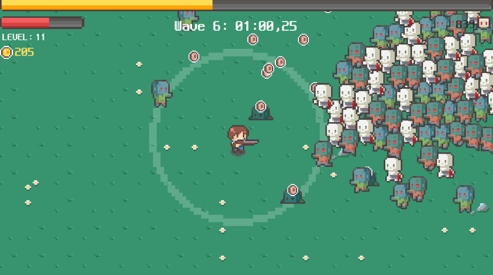
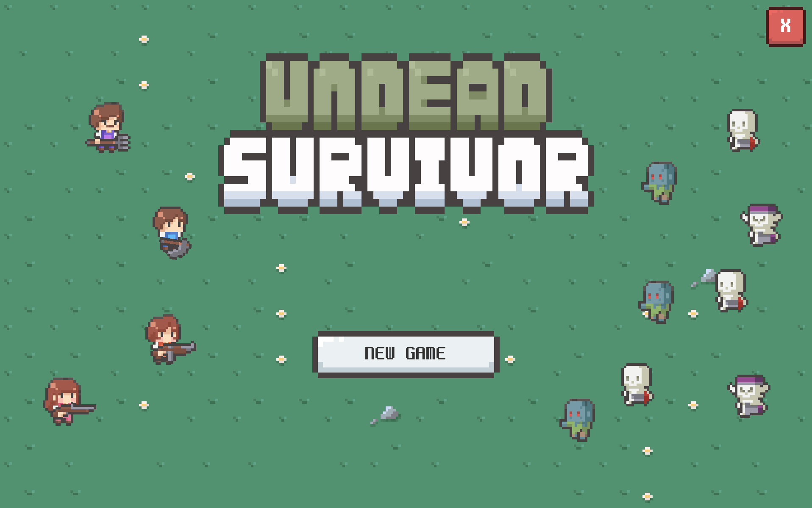
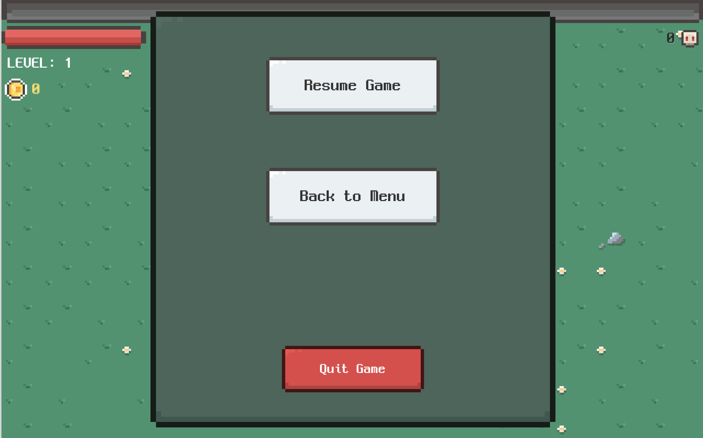

## Project Overview
> Unity 익히기용 클론 코딩 프로젝트 [youtube](https://www.youtube.com/playlist?list=PLO-mt5Iu5TeZF8xMHqtT_DhAPKmjF6i3x)

## Features
- 2D Infinite Map
- Object Pooling
- Main / Option / Game Scene
- Audio System
- Mobile Build

## Controls
- 

## Build & Run
- Run at Unity

## Development Enviroment
- OS: Windows 10
- Architecture: Intel
- Language: C#
- Compiler: 
- Framworks: Unity
- Build Tool:

## Team Members
[roadl](github.com/roadl)
